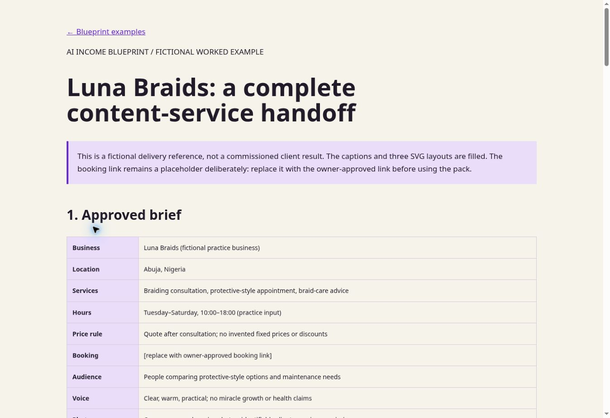

# Verification of the upgraded Blueprint

Checked 6 October 2026 against the deployed app and a signed-out Cloudflare branch preview.

- Seven SQLite-backed backend tests pass: saved selection, invalid/unauthenticated requests, non-destructive default-task refresh, ownership, sheets, auth/CSRF boundaries, progress metadata and arithmetic.
- 24 HTML pages pass local-link and duplicate-ID checks. Ten playbooks have free/paid routes, complete prompts, outputs/checks, connected next guides and existing downloadable examples.
- All JavaScript files parse. There are 52 saved playbook steps, exactly 50 action prompts and 300 reference prompts.
- Live diagnostic returns and saves the service route. Workbench selection survives reload, shows the matching next unfinished task and opens Playbook F.
- Paid/free tool buttons switch the displayed workflow. Copying reports success.
- The 50-prompt text download completes. Filtering to F shows five prompts; search further narrows the results.
- Calculator: hypothetical 1,000 credits, 10 per attempt, three attempts and two shots produces 16 estimated edits. Five attempts produces 10. Inputs are expressly hypothetical.
- All nine tool brand icons load. The filled salon handoff opens and renders correctly.
- The public preview works at both `/preview.html` and Cloudflare's canonical `/preview`. A signed-out request for full prompts redirects to login.
- Production serves the upgraded workbench after `main` was fast-forwarded to the same tested tree as `master`.

Payment transactions, the external Whop listing/marketing homepage and an account-specific withdrawal date were not changed or certified. No real messages or purchases were made. The existing test account was used for UI checks; its selected route is services.
